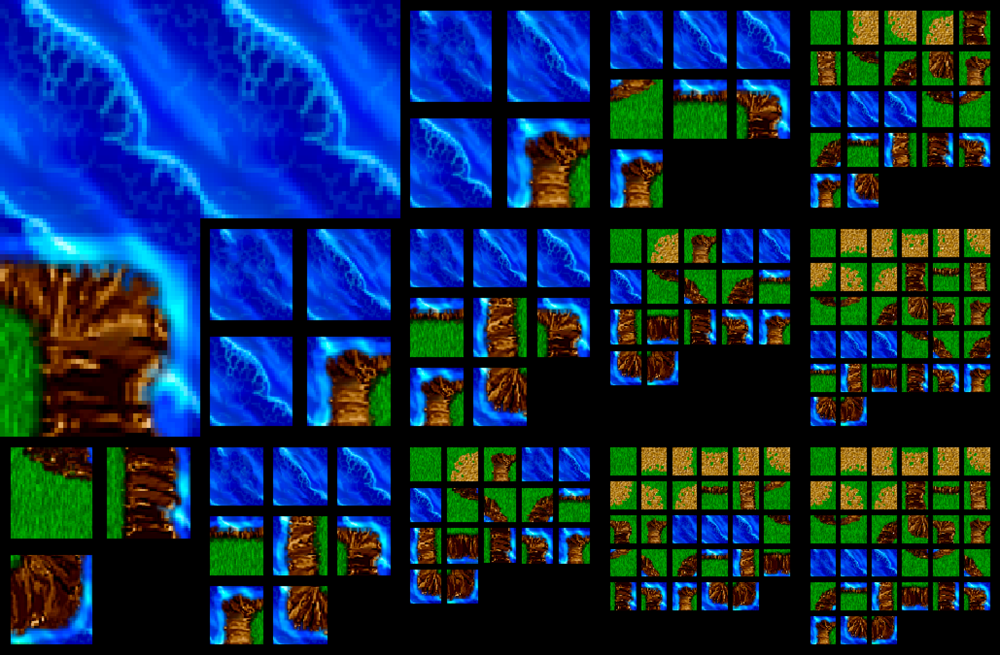
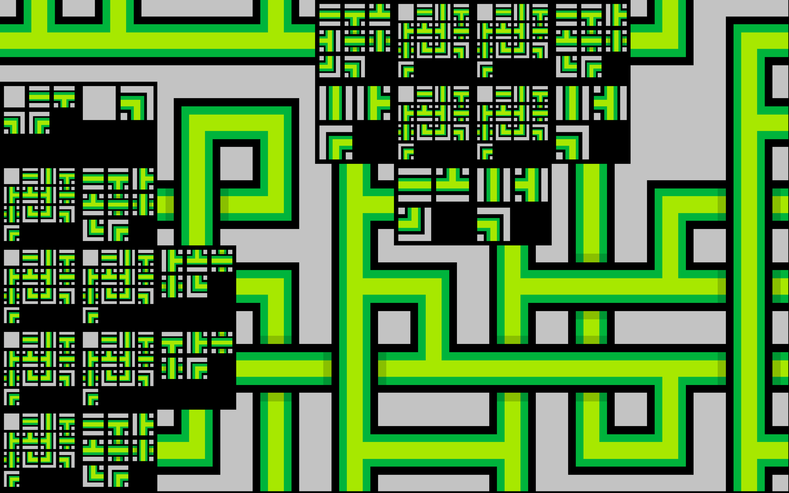
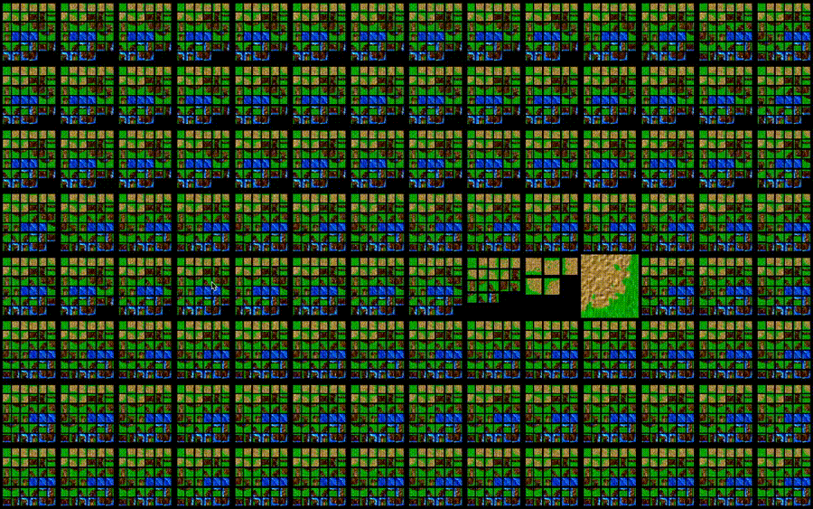
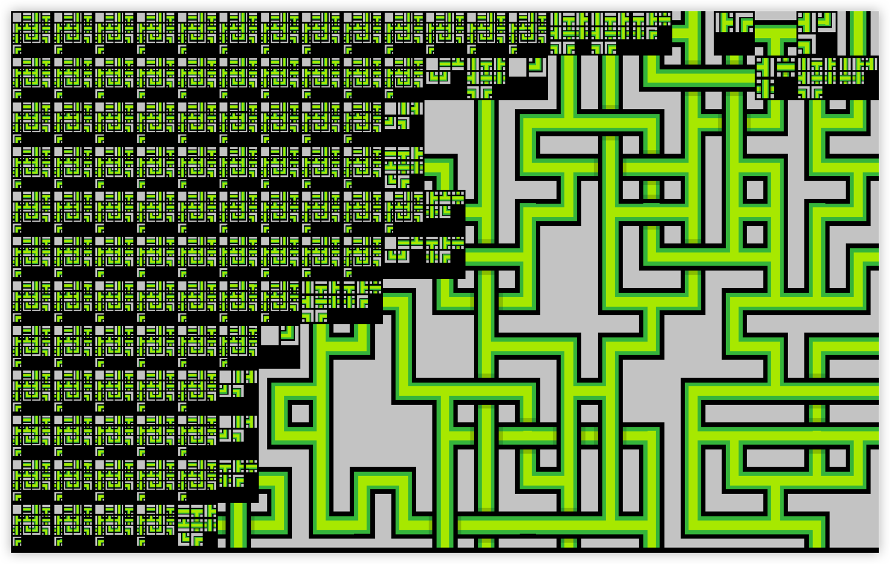
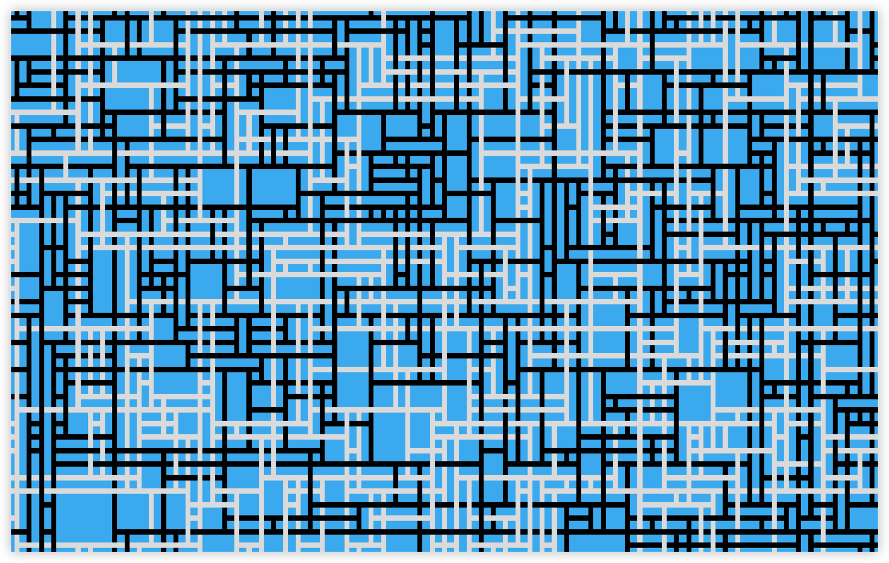
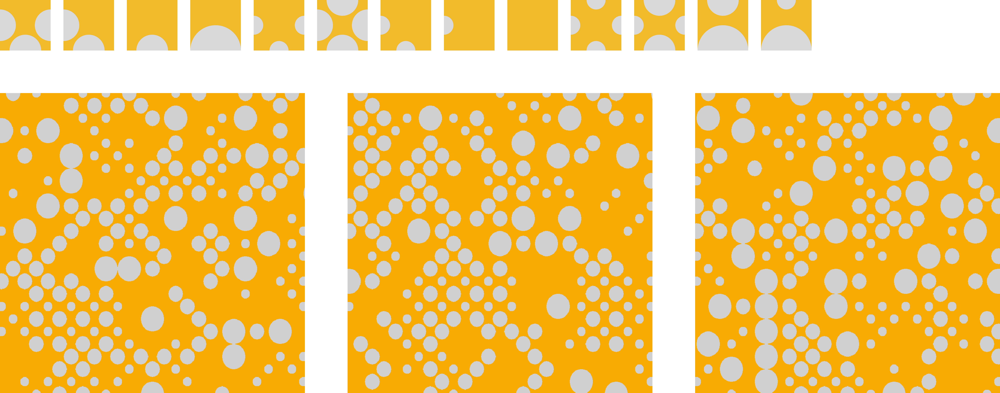

#  Wave Function Collapse Simulation

## 🌊 О проекте

Это проект на `C++`, использующий библиотеку `SFML` для создания симуляции алгоритма Wave Function Collapse (WFC),
который применяется для создания уникальных случайно сгенерированных паттернов.

<p align="center"></p>

**Как работает алгоритм:**

1. Сначала задаются правила, по которым текстуры могут соединяться.
2. Изначально в каждой ячейке могут быть все возможные варианты текстур. Затем мы "коллапсируем" одну из ячеек, т.е. устанавливаем в ней конкретную текстуру. В таком случае в соседних ячейках количество вариантов возможных текстур уменьшается —начинает распространяться "волна коллапса", которая убирает неподходящие текстуры.
3. Мы продолжаем коллапсировать случайные ячейки и распостронять волн коллапса до тех пор, пока все изображение не будет сгенерированно.

**Технологии:** `С++`, `SFML`

## 👀 Функционал

В каждой ячейке отображаются возможные текстуры.

<p align="center"></p>

Когда мы коллапсируем ячейку, то видно, как распостраняется "волна коллапса."

<p align="center"></p>


Можно запустить автоматическую генерацию, а можно поставить на паузу и коллапсировать ячейки вручную с помощью правой кнопки мыши.

<p align="center"></p>

Каждый раз генерируется уникальное случайно сгенерированное изображение. 
Доступны различные текстуры для генерации и есть возможность загружать собственные.

<p align="center"></p>
<p align="center"></p>
<p align="center"></p>


## 🎮 Использование

- Для запуска или паузы генерации нажмите `SPACE`.
- Для сброса сгенерированного паттерна нажмите `R`.
- Для коллапсирования конкретного фрагмента нажмите по нему правой кнопкой мыши.

## ⚙️ Конфигурация

Файл `config.h` содержит параметры для настройки генерации изображения. Вы можете настроить размер окна, количество
фрагментов разбиения и выбрать изображения для генерации паттернов.

```c++
const int H = 800; // высота окна
const int BLOCK_COUNT_H = 12; // количество фрагментов разбиения по вертикали
const float DELTA_TIME = 0.005f; // минимальное время между итерациями (0 для наискорейшей генерации)
const TileType TILE_TYPE = TileType::GREEN_KNOTS; // изображения, которые будут использоваться для генерации
```

## 🤌🏻 Контакты

Макс Кудряшов - [👾 GitHub](https://github.com/kudrmax) - [💬 Telegram](t.me/kudrmax)