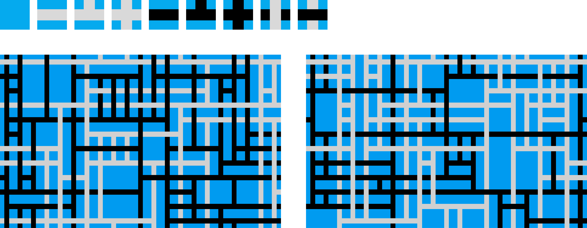

# Wave Function Collapse Simulation


## Описание

Это проект на `C++`, использующий библиотеку `SFML` для создания симуляции алгоритма Wave Function Collapse (WFC),
который используется для создания уникальных случайно сгенерированных паттернов.

## Технологии

- `С++`
- `SFML`

## Пример




[//]: # (![Function Collapse Example]&#40;images/example 1.png&#41;)

## Использование

- Для запуска или паузы генерации нажмите `SPACE`.
- Для сброса сгенерированного паттерна нажмите `R`.
- Для коллапсирования конкретного фрагмента нажмите по нему правой кнопкой мыши.

## Конфигурация

Файл `config.h` содержит параметры для настройки генерации изображения. Вы можете настроить размер окна, количество
фрагментов разбиения и выбрать изображения для генерации паттернов.

```c++
const int H = 800; // высота окна
const int BLOCK_COUNT_H = 12; // количество фрагментов разбиения по вертикали
const float DELTA_TIME = 0.005f; // минимальное время между итерациями (0 для наискорейшей генерации)
const TileType TILE_TYPE = TileType::GREEN_KNOTS; // изображения, которые будут использоваться для генерации
```

## Установка

1. Убедитесь, что у вас установлен `C++` компилятор и `SFML` библиотека.
2. Клонируйте репозиторий:

   ```bash
   git clone https://github.com/your-username/fave-function-collapse.git
   ```

3. Перейдите в директорию проекта:

   ```bash
   cd fave-function-collapse
   ```

4. Соберите проект:

   ```bash
   g++ -o fave_function_collapse main.cpp -lsfml-graphics -lsfml-window -lsfml-system
   ```

5. Запустите приложение:

   ```bash
   ./fave_function_collapse
   ```


## Контакты

[Telegram](t.me/kudrmax) - [GitHub](https://github.com/kudrmax)